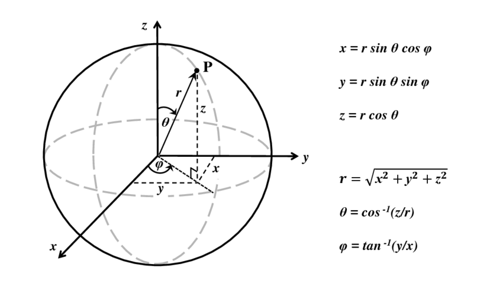

<!-- theme: default -->
<!-- class: invert -->
<!-- paginate: true -->

# Le path tracing

Light go brr

---
# What is path tracing

The goal: Global Illumination!

Mathematician: An algorithm for estimating the _rendering equation_ numerically using Monte Carlo methods.

Programmer: Shooting a bunch from a camera, bouncing them around a scene until they hit a light, and averaging their contribution.

---
# What is path tracing

The goal: Global Illumination!

Mathematician: An algorithm for estimating the _rendering equation_ numerically using Monte Carlo methods.

Programmer: Shooting a bunch from a camera, bouncing them around a scene until they hit a light, and averaging their contribution.

**I will focus on the mathematicians view!**

---
# The rendering equation (Simplified)

$$ L_o = L_e + \int_\Omega f_r \ L_i \ cos (\theta) \ d\omega$$

- $L_o$ - Outgoing light from the given point
- $L_e$ - _Emitted_ light from the given point
- $\Omega$ - The hemisphere of directions oriented around the normal
- $f_r$ - Ratio of incoming and outgoing light (BRDF)
- $L_i$ - Light incoming to the given point
- $cos(\theta)$ - Cosine term (N dot L) - more on this later

---
# The rendering equation (Simplified)
(Show image)

---
# Integration primer

For simple univariate functions, integration is equivalent to "finding the area under the function".

A discrete method is a Riemann sum: Split into $n$ rectangles with height given by the integrand, sum their area:

$$ \sum_{i=0}^n f(x_i) \Delta x_i $$

---
# Integration primer

The limit of a Riemann sum is a definite integral:

$$ \int_a^b f(x) dx = \lim_{n\rightarrow\infty} \sum_{i=0}^n f(x_i) \Delta x_i $$

Where $x$ ranges from $a$ to $b$. We can imagine a definite integral as a Riemann sum of _infinitely_ thin rectangles.

This infinitely small quantity, $dx$, is called a differential.

---
# Integration primer

Definite integrals typically look like this:

$$ \int_a^b f(x) dx $$

Fundamental theorem of calculus tells us that (assuming continuity):

$$ \int_a^b f(x) dx = F(b) - F(a) $$

Where $\frac{d}{dx} F(x) = F'(x) = f(x)$

---
# Integration primer

Sometimes the domain of integration is written at the bottom, as we saw in the rendering equation:

$$
\int_D f(x) dx
$$

This notation lets us use more complex domains, such as "a hemisphere of directions"

---
# Spherical integrals

Just as we can integrate over a number line, we should be able to integrate over the surface of a unit sphere. To do so, we can use spherical coordinates.

---
# Spherical integrals

A naive approach would be a double integral like so:

$$
\int_0^{2\pi} \int_0^\pi f(x) \ d\theta \ d\phi
$$

We know that the surface area of a sphere is $4\pi r^2$, so for a unit sphere, $4\pi1^2 = 4\pi$. 

---
# Spherical integrals

Let's try integrating the constant $1$ over the unit sphere using this naive approach. This should give us the surface area of the sphere.

$$
\int_0^{2\pi} \int_0^\pi 1 \ d\theta \ d\phi = \int_0^{2\pi} \pi \ d\phi = 2 \pi^2
$$

That is definitely not $4\pi$! It turns out we are missing a correction factor for the curvature of a sphere.

---
# Spherical integrals

When we integrate over a sphere, our differential is an infinitely small quadrilateral surface patch on the sphere surface.

Notice how the top and bottom edge of the differential surface patch are different lengths!

---
# Spherical integrals

Need to account for the shape of the differential, otherwise we are just integrating over a perfectly rectangular plane!

The height of the quadrilateral is $d\theta$, but the width is $sin(\theta)d\phi$. Notice how the sine term makes the width small when theta is close to one of the poles.

---
# Spherical integrals

We can revisit our naive method, and add the correction factor of $sin(\theta)$:

$$
\int_0^{2\pi} \int_0^\pi 1 \sin(\theta) \ d\theta \ d\phi = \int_0^{2\pi} 2 \ d\phi = 4 \pi
$$

And now we get the correct surface area of the unit sphere, $4\pi$, so this method of spherical integration works.

---
# Spherical integrals

We can turn the spherical integral into a hemispherical one by changing range of integration for $\theta$ to $[0; \frac{\pi}{2}]$:

$$
\int_0^{2\pi} \int_0^\frac{\pi}{2} 1 \sin(\theta) \ d\theta \ d\phi = \int_0^{2\pi} 1 \ d\phi = 2 \pi
$$

---
# Spherical integrals

Recall the rendering equation, which was contained a hemispherical integral: 

$$ L_o = L_e + \int_\Omega f_r \ L_i \ cos (\theta) \ d\omega$$

Remember, $\Omega$ denotes a unit hemisphere of directions. Why does this look different from what we've seen, and what exactly is $d\omega$?

---
# Spherical integrals

The formulation of the rendering equation shown earlier looks different because it is integrating over _solid angle domain_. I'll talk more about solid angles later, but for now, note that:

$$
d\omega = \sin(\theta) d\theta d\phi
$$

Thus:

$$
\int_\Omega f(x) d\omega_x = \int_0^{2\pi} \int_0^{\frac{\pi}{2}} f(\theta, \phi) sin(\theta) d\theta d\phi 
$$

---
# Spherical integrals

A final note on spherical integrals: Why use this alternate integration domain and not just spherical coordinates? 

Essentially, this is just because it makes the math much nicer. There is nothing stopping us from writing the rendering equation out with a parameterisation using spherical coordinates.

Solid angles are ubiquotous in light transport because they have some nice properties we will see later.

---
# The rendering equation revisited

Let's take another look at the rendering equation. 

$$ L_o = L_e + \int_\Omega f_r \ L_i \ cos (\theta) \ d\omega$$

Now that we know a bit about hemispherical integrals, can we calculate it analytically? No, because the incoming light from a given direction $L_i$ depends on the scene we are rendering!

There exists no general solution to the rendering equation, so what can we do?

---
# Monte carlo methods

Let's say we want to calculate a simple integral of the form:

$$
\int_a^b f(x) dx
$$

But we are unable do anything else with $f(x)$ than evaluate it, so we can't get the antiderivative.

If we can't solve it analytically, maybe we can do it numerically?

---
# Monte carlo methods

We could use a riemann sum, but this won't work well for high dimensional integrals, such as the rendering equation, due to the _curse of dimensionality_ - there is just too much space to cover in the integration domain.

Instead, we can use _monte carlo methods_, which are stochastic methods relying on random sampling of the domain.

---
# Monte carlo methods
The basic idea of monte carlo methods is to sample the domain randomly many times, and average the results.

<!-- For example, if we wanted to determine the average age of a population, we could ask a subset of the population, and average the ages we observe. As the subset grows larger, our estimate will approach the _actual_ average age. This is a simple monte carlo method. -->

For our purposes, we are interested in a specific kind of monte carlo method typically called monte carlo integration, which is used for estimating definite integrals like ours.

$$
\int_a^b f(x) dx
$$

---
# Monte carlo integration

In probability theory, we have a theorem called the Law Of The Unconcious Statistician (LOTUS). It is written: blablabla

$$

$$

---
# Monte carlo integration

The cornerstone of monte carlo integration is the monte carlo _estimator_. For our simple placeholder integral, it can be written as so:

$$
\frac{1}{N}\sum_{i=0}^N \frac{f(X_i)}{p(X_i)}
$$

- $N$ denotes the amount of random samples we have taken
- $X$ is a random variable
- $p(x)$ is the _probability density function_ of $X$
- $f(x)$ is our integrand from earlier.

---
# Monte carlo integration

- Intuition for division of pdf
- Inverse transform method
- Importance sampling

---
# Diffuse reflection

- lambertian
- cos (theta)
- solid angle
- cosine weighted distribution
    - why does cosine disappear

---
# Specular reflection

- fresnel
- mixing refraction and reflection
- microfacet brdf

---
# Next Event Estimation

- direct light sampling
- change integration from differential projected area to different solid angle
- mis?

---
# Why do we divide albedo by pi? (WRONG)

Let's try calculating total reflected outgoing energy without it:
$$ \int_\Omega f_r \ L_i \ cos(\theta) d\omega = \int_\Omega albedo \ L_i \ cos(\theta) d\omega $$

We can pull out $albedo$ and $L_i$ as they are both constant:

$$ \int_\Omega albedo \ L_i \ cos(\theta) d\omega = albedo \ L_i \int_\Omega \ cos(\theta) d\omega $$

---
Now, note that:
$$ \int_\Omega  cos(\theta) d\omega = \int_0^{2\pi} \int_0^{\frac{\pi}{2}} cos(\theta) sin(\theta) d\theta d\phi = \int_0^{2\pi} \frac{1}{2} d\phi = \pi $$

So we get:

$$
albedo \ L_i \int_\Omega \ cos(\theta) d\omega = albedo \ L_i \ \pi
$$

<!-- L_i is constant here because we are integrating over outgoing, not incoming directions -->

Oh no! This does not satisfy energy conservation:

$$
\int_\Omega f_r \ L_i \ cos(\theta) d\omega \leq L_i
$$
---
If we divide albedo by $\pi$:

$$ \int_\Omega \frac{albedo}{\pi} \ L_i \ cos(\theta) d\omega = albedo \ L_i $$

We reflect exactly incoming incoming energy attenuated by albedo, and energy conservation is satisfied.

---
# Lambertian N dot L special case

$$ \int_\Omega f_r \ L_i \ cos(\theta) d\omega = \int_\Omega \frac{albedo}{\pi} \ L_i \ cos(\theta) d\omega$$
$$ = \int_0^{2\pi} \int_0^{\frac{\pi}{2}} \frac{albedo}{\pi} \ L_i \ cos(\theta) sin(\theta) d\theta d\phi$$

Assume single directional light with direction (a, b) in spherical coordinates:

$$ = \int_0^{2\pi} \int_0^{\frac{\pi}{2}} \delta_{light}(\theta, \phi) \frac{albedo}{\pi} \ L_i \ cos(\theta) sin(\theta) d\theta d\phi $$

---

Directional lights send rays only in one direction, described by a delta distribution.

$$ \delta_{light}(\theta, \phi) = \frac{\delta(\theta-a) \delta(\theta-b)}{sin(a)} $$

Now we can solve the integral: 
$$\int_0^{2\pi} \int_0^{\frac{\pi}{2}} \delta_{light}(\theta, \phi) \frac{albedo}{\pi} \ L_i \ cos(\theta) sin(\theta) d\theta d\phi = \frac{albedo}{\pi}cos(a)$$

Note now that $cos(a)$ is precisely "N dot L" as you typically know it, so this matches typical realtime shading.

---
# The rendering equation revisited

$$ L_o(x, \omega_o) = L_e(x, \omega_o) +\int_\Omega f_r(x, \omega_i, \omega_o) L_i(x, \omega_i) (\omega_i \cdot n) d\omega_i$$

- $x$ - position in space
- $\omega_o$ - outgoing direction of light (towards the eye)
- $\omega_i$ - incoming direction of light (towards the light)
- $n$ - surface normal vector at $x$
- $\Omega$ - hemisphere of unit directions oriented around $n$

---
# The rendering equation revisited

$$ L_o(x, \omega_o) = L_e(x, \omega_o) + \int_\Omega f_r(x, \omega_i, \omega_o) L_i(x, \omega_i) (\omega_i \cdot n) d\omega_i$$

- $L_o(x, \omega_o)$ - light leaving $x$ in direction $\omega_o$
- $L_e(x, \omega_o)$ - light _emitted_ at $x$ in direction $\omega_o$
- $f_r(x, \omega_i, \omega_o)$ - proportion of light reflected from $\omega_i$ to $\omega_o$ (BRDF)
- $L_i(x, \omega_i)$ - light incoming at $x$ from direction $\omega_i$
- $(\omega_i \cdot n)$ - Cosine term (N dot L)